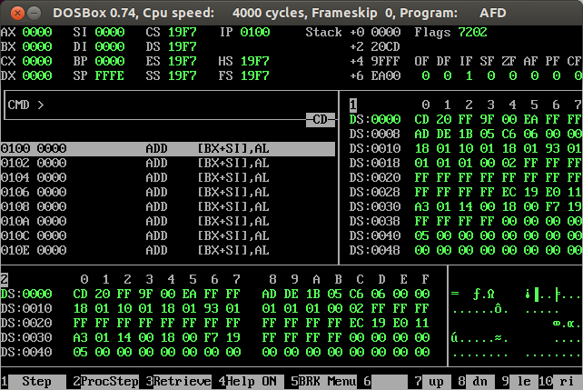

<h1 align="center">
	  

	NASM
</h1>

#

Small tutorial for Nasm and Linux

## Setting Insight on Ubuntu: http://www.dalfonso.co/2016/04/23/setting-insight-debugger-on-ubuntu-16-04-lts/

## [Book on Google Books](https://books.google.com.br/books?id=veMTOpapeZkC)

## Resources on Operating Systems
	http://www.jamesmolloy.co.uk/tutorial_html/index.html
	http://www.osdever.net/bkerndev/Docs/gettingstarted.htm